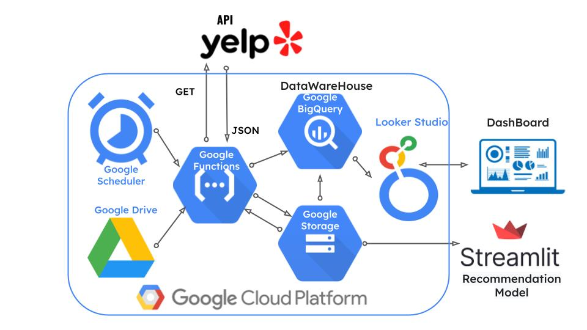

# Proyecto Final Henry

En el presente repositorio se lleva a cabo un estudio de mercado de restaurantes de comida de mar en los estados pertenecientes a la costa sudeste de los Estados Unidos de América, Florida, Maryland, Georgia, Carolina del Norte, Carolina del Sur y Virginia. Los resultados arrojados por nuestro trabajo se ven reflejados en un Dashboard diseñado en Looker y en un modelo de recomendación montado en Streamlit.  

<em>Nota al lector</em> 

<em>En una primera instancia, contábamos con datos de establecimientos y de reseñas tanto de Google Maps como de Yelp. Con el alcance definido como los 6 estados mencionados en la introducción se comenzaron a podar las bases de datos iniciales, despojándolas de columnas y registros irrelevantes. Nos topamos con el problema de que la base de datos de Yelp únicamente contenía información sobre uno solo de los estados seleccionados, por lo que conseguir datos de los territorios faltantes fue el próximo paso a dar, y, una vez concretado, nos vimos enfrentados nuevamente ante un desafío. La nueva base de datos tenía <strong>muchos más registros</strong>, pero <strong>carecía de información sobre reseñas</strong>. La resolución fue como sigue: se usarán datos de Google Maps para el análisis de datos, pues la información sobre las reseñas es vital, y datos de Yelp para el modelo de recomendación, puesto que únicamente se necesitan datos de establecimientos y esta tabla es más completa.</em>

## Ingeniería de datos

La ingeniería de datos se dividió en dos partes: una para el análisis, que trabajó con los datos de Google, y una para el modelo de Machine Learning, que trabajó con Yelp.  

### Reviews de Google por Estado

Inicialmente, se nos proporcionan datos de reseñas de Google organizados por estado. Estos datos se presentan en forma de archivos JSON, que no son tabulares por naturaleza.

En el script `reviews_state.ipynb`, hemos desarrollado un algoritmo que permite recorrer cada carpeta correspondiente a un estado y seleccionar cada archivo JSON. Luego, integramos todos estos archivos en un único archivo final para cada estado.

A continuación, creamos un DataFrame utilizando la biblioteca Pandas a partir de este archivo, y agregamos un campo "State" que contiene la abreviatura del estado. Además, convertimos el formato de tiempo de milisegundos a una fecha legible.

Finalmente, almacenamos el archivo resultante en formato Parquet para reducir su tamaño en megabytes (MB).

### Metadata de Sitios en Google

Los datos de Metadata de Sitios en Google se presentan en archivos JSON separados por comercio. Cada archivo contiene información relevante, como Nombre, Id, Cantidad de Reseñas, Calificación, Longitud, Latitud, Dirección y otros datos relacionados con cada comercio.

En el script `estados_meta_google.ipynb`, cargamos cada archivo en un DataFrame y realizamos una eliminación inicial de datos duplicados. Luego, creamos una columna "estados" y asignamos la abreviatura del estado al que pertenece, basándonos en la información de dirección proporcionada en los datos.

Dado que el DataFrame contiene información de todos los estados, generamos un filtro para seleccionar los comercios de los estados preseleccionados. Posteriormente, creamos un nuevo DataFrame que contiene solo los comercios correspondientes a cada estado en cada archivo JSON.

En última instancia, creamos un DataFrame final que contiene los comercios seleccionados por estado en cada archivo JSON.

### API de YELP

En un análisis preliminar de los datos de YELP, observamos que el archivo que contenía información sobre negocios en el territorio nacional se centraba principalmente en el estado de Florida.

Debido a esta limitación, decidimos obtener información adicional mediante el consumo de la API de YELP.
<ul>
<li>Esta API permite un máximo de 1000 resultados por consulta.
<li>Para realizar una consulta, ingresamos una abreviatura o nombre de ciudad para especificar la ubicación deseada.
<li>Para utilizar la API, primero generamos una API_KEY registrándonos en YELP y debemos agregar "Bearer" antes de la API_KEY en las solicitudes.
<li>La API nos proporciona un código inicial para generar consultas desde otro entorno, y un código de respuesta exitosa es "200".
<li>El formato de respuesta de la API es JSON.
</ul>

### Google Function - API YELP

Después de consumir la API de YELP, fue necesario automatizar el proceso de búsqueda y almacenamiento de datos utilizando Google Cloud Platform.

Google Functions permitió la implementación de nuestro script de Python para consumir la API y almacenar los datos en Google Storage. Desde Google Storage, podemos acceder a los datos para realizar análisis o crear modelos de recomendación.

<ul>
<li>Google Functions es un servicio en la nube que permite la implementación de scripts.
<li>Puede ejecutarse de manera automatizada y sin problemas.
<li>Permite asignar recursos de RAM y CPU según las necesidades de la tarea.
<li>Ofrece entornos de ejecución para Python, Node, Go y otros lenguajes.
<li>El archivo "main.py" ejecuta nuestra Function con la tarea a realizar, y en "requirements.txt" se declaran las bibliotecas necesarias.
</ul>
Para obtener una descripción detallada de cómo implementamos Google Functions para obtener los datos de YELP y almacenarlos en un Bucket de Google Storage, consulte el archivo "FuncionYelp.ipynb".

### Google Maps

La carpeta <em>ingenieria_google</em> replica en estructura, los buckets del proyecto montado en Google Cloud. Su función es brindarle al lector un entendimiento más profundo sobre cómo se llevaron a cabo los procesos de ingeniería, facilitándole una posibilidad de hacer lo que hace la nube, pero <strong>de forma local.</strong> Las carpetas <em>data-procesada</em> y <em>data-preprocesada</em> (esta última dentro de la carpeta de <em>data-cruda</em>), se encuentran vacías, e invitamos a correr las celdas en el archivo <em>cloud_functions.ipynb</em> para ver los resultados finales. La única diferencia estructural con la del proyecto en la nube, es el agregado de la carpeta <em>archivos_adicionales</em>, que contiene un archivo en formato csv necesario para poder imitar los procesos de Cloud Functions, y por otro lado, un archivo llamado <em>scripts.py</em>. Este último archivo, fue un primer acercamiento a lo que tenía que pasar en la nube. Se encuentra en la máquina virtual del proyecto, y al ejecutarse a través de comandos por terminal, realiza todas las partes que hacen las funciones.

## Recomendador de Inversión
Este proyecto implementa un modelo de Machine Learning de sistema de recomendación que se centra en identificar similitudes entre restaurantes de comida de mar en cada estado del sureste de los Estados Unidos. Su objetivo principal es ayudar a los inversionistas a tomar decisiones informadas sobre dónde invertir en restaurantes de comida de mar en esta región.  

### Funcionalidades Principales
<ol>
<li><strong>Identificación de Estados sin Presencia:</strong> El modelo permite identificar en qué estados del sureste de EE. UU. carecen de presencia de restaurantes de comida de mar. Esto es crucial para evaluar oportunidades de inversión en lugares no saturados.</li>
 
<li><strong>Similitud Competitiva:</strong> Ofrece la capacidad de calcular la similitud competitiva entre dos restaurantes. Si el resultado es 1, significa que son competidores directos, mientras que 0 indica que son opuestos en términos de categoría y ubicación.</li>
 
<li><strong>Estudio Detallado del Sector:</strong> La aplicación "Recomendador de Inversión" proporciona herramientas para realizar un estudio más detallado del sector. Puedes acceder a consultas por estado de los 5 mejores restaurantes, revisar reseñas, realizar segmentación, explorar la ubicación geográfica y obtener información relevante para el análisis de indicadores por estado.</li>
 
<li><strong>Indicadores de Inversión y Mercado:</strong> La aplicación presenta indicadores clave por estado, como el índice de DCP promedio y el valor máximo de percepción del comercio. También proporciona indicadores de inversión, como el DCP (Densidad de Consumo Potencial según la población).
</li>
</ol>

### Uso
La aplicación se desarrolla en Streamlit, lo que la hace fácil de usar e intuitiva. Simplemente selecciona el estado que te interesa y explora las diversas funcionalidades y datos disponibles para tomar decisiones informadas de inversión.

## Documentación

Por último, la carpeta <em>documentacion</em> contiene una serie de archivos que se fueron creando a lo largo del proyecto en los que se documenta, con gran detalle, el avance y se comprende la escencia del trabajo.

### Stack Tecnologico
- Google Drive con la data inicial
- Google Scheduler para programar la ejecución de funciones.
- Google Function para ejecutar las tareas de ETL de la data
- Google Storage para almacenar la data sin procesamiento
- Google BigQuery para generar Tablas relacionales
- Google Looker Studio para implementar un Dashboard 
- API Yelp para generar informacíon actualizada de los comercios
- Streamlit para implementar una interfaz de modelo de recomendación

### Enlaces:
Looker: https://lookerstudio.google.com/reporting/9790a648-f9cc-4c3f-a798-89fe829d7c3f/page/isZcD?utm_source=canva&utm_medium=iframely
Deploy: https://sistemaderecomendacion.streamlit.app/
Video: https://www.youtube.com/watch?v=_xc1YLeIemY
